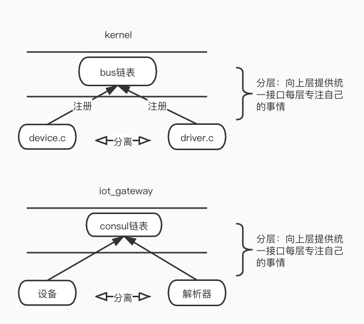

### iot网关

#### 1.介绍

该项目是课余时间，按照自己认为的理想的IOT系统架构，实现的一套智能家居系统。目前部署在自己的卧室，实现用小度音箱对室内灯的控制。

#### 2.设计思想

在物联网产品接入层方面，对比过阿里云物联网、联通物联网、某消防iot公司、某电动车等公司的架构，但是发现很难达到自己认为理想的架构。发现这些架构设计中，要么是忽略解耦性，要么是忽略开发效率，要么单纯云端思想设计整个iot。相比于前后端，在iot产品开发中需要考虑的问题要更加复杂。

iot开发中，最重要的一点是"**高内聚,低耦合**"，而实现这一思想的关键是**解析器**，解析器是要由嵌入式人员编写的，对上下行数据的一个解包和封包。

**【问题】**

iot产品开发中常见问题：

1. 缺乏上下行解析器层，导致开发中高度耦合，云端人员需要知道嵌入式人员上传的协议，日后协议的更新、bug的修复、判断逻辑的修改、分包合包逻辑等都需要两份人力去维护这个协议。
2. 现在解析器实现方案中，多数是用脚本引擎实现，由一段简单的脚本语言实现，可是嵌入式人员技术栈是c/c++，而且这样导致解析器调试困难无法打印log，上下行解析器无法沟通，难以存储历史数据，开发中，自由度不高，常常需要云端参与支持等。
3. 通信协议选型方面，不考虑内存、flash占用，弱网通信，窄带通信，低功耗等问题，依然按照前后端思想开发。如使用msgpack序列化压缩传输数据，在后端差别不大，但是在arm嵌入式平台上，空间占用较大，可能导致栈溢出。
4. 云端人员不知道常见硬件潜在风险。如下行修改终端配置信息后，立刻重启导致保存flash失败
5. 报警类信息由云端来做逻辑判断，导致不及时。
6. 随着不断新增硬件产品，需要不断修改云端代码以适配。
7. 软硬人员两地办公，沟通效率低
8. ...

**【解决思路】**

在linux驱动开发中，有一种抽象的思想是“分层，分离”，使得操作系统能做到支持多种硬件接入，而不需要重新编译系统，有着很好的解耦性。

- 分离使得硬件相关的和非硬件相关的代码分开独立修改和发布。
- 设备链表实现了设备的动态接入和拔出，设备之间通过name动态匹配。
- 分层使得操作系统提供了driver层，即统一接口层，如register、read、write。一款新设备的接入，只需要厂商自己提供device设备和驱动程序driver， 而不需要修改操作系统任何内容即可。

与操作系统类似，iot系统也需要动态支持丰富的硬件类型，同样不能因为硬件的修改导致iot系统重新编译。
这也体现了现在流行的微服务思想，如独立发布、跨语言等。

**设备**指的就是终端产品，云端可以根据终端上传的设备类型去服务链表中找到对应的解析器。

**grpc**提供了通用函数：marshal 、unmarshal。而且grpc序列化和反序列化速度较快，支持c++等丰富语言，第三方包支持c语言。

**解析器**相当于windows下安装的驱动，完全由设备厂商编写。云端人员不关心与设备的通信协议，协议只有嵌入式人员自己维护，iot_gateway最终得到的就是一份明文的、完全解析完毕的数据包。解析器也可以根据实际不同类型设备使用量，来部署节点数量

**其他选型参考**

**protobuf**：终端通信中选用protobuf，相比去其他序列化协议如msgpack，更加灵活通用。尤其在终端上的表现protobuf更加节省内存和flash。可使用第三方c语言的nanopb插件来支持嵌入式更优性能。

协议方面共有两层protobuf，一层是和终端通信，一层是grpc协议

**EMQ**：mqtt协议，在高并发中支持较好，文档详细，功能丰富。

#### 3.使用

需要依赖环境包括EMQ，consul，cmake。测试环境是ubuntu64

**iot_gateway**是图中的iot_gateway. 

编译:

`make target=linux`

运行：

`./gateway`

[**xiaodu_parser**](https://github.com/ldmid666/xiaodu_parser)是go实现的解析器。

编译：

 `make target=linux`

运行：

`make run`

[**xiaodu_parser_c**](https://github.com/ldmid666/xiaodu_parser_c)是c语言实现的解析器，嵌入式人员更习惯c/c++。

编译：

`./build.sh`

运行：

`./parser_c`

#### 4.其他说明

iot产品种类复杂，有的是移动，有的是静止，有的是宽带，有的是窄带，有的要低功耗，有的要低延迟等。针对不同产品，需要考虑的问题也常常有较大的不同，iot_gateway还需要做更多兼容性。

1. iot_gateway_v1工程只是网关的实现demo，应用层代码应该在网关层之上实现。
2. 嵌入式应该把一些可以转移的逻辑放在解析器层实现，这样日后有bug容易修复，减少OTA升级设备。
3. 安全方面，如果是第三方提供网关服务，应该考虑是双层加密。如lora方式
4. iot产品有时会处于弱网通信，此时应考虑弱网优化，如udp在弱网下消耗更小。弱网应控制传输包的大小在1400字节以下。
5. 针对不同网络类型不同对待。如wifi链路超时一般低于4G网。NAT网络下注意心跳周期不高于3分钟。

**【参考】**

[《小度技能平台》](https://dueros.baidu.com/dbp/debug/index#/audio/?botId=38657853-65da-c980-50f9-6fa6309c9756）)

[《LoRaWAN network-server》](https://github.com/brocaar/chirpstack-network-server)

[《grpc》](https://github.com/grpc/grpc-go)

[《protobuf》](https://github.com/protocolbuffers/protobuf)

